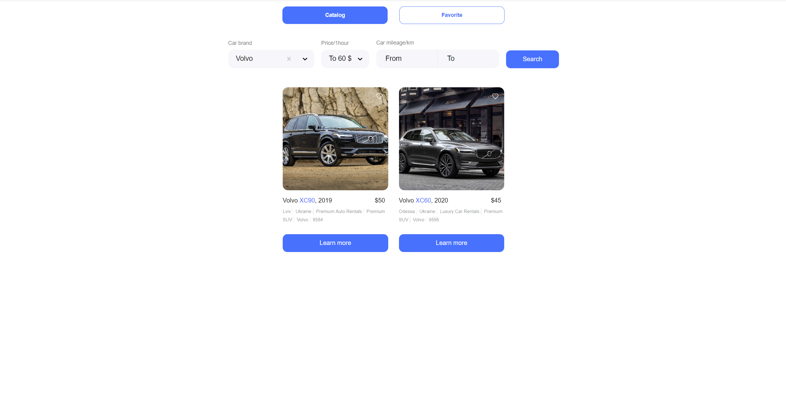
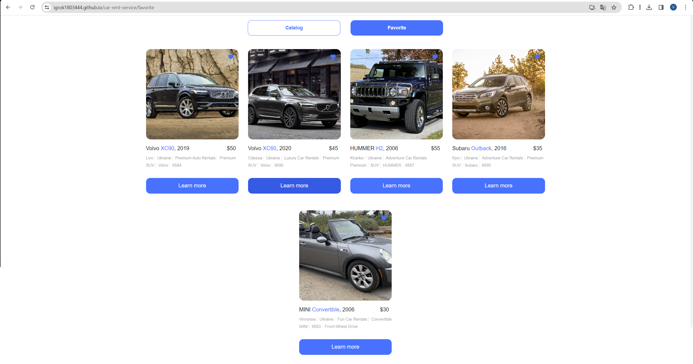

# Car Rent Service

Це веб-додаток для прокату автомобілів, розроблений з використанням React та інших технологій.

## Опис

Цей проект створено для надання можливості користувачам орендувати автомобілі через інтернет. Він містить функції перегляду автомобілів, пошук автомоболя за ціною оренди, пробігом і маркою.

## Встановлення

1. Клонуйте цей репозиторій: git clone https://github.com/igrok1803444/car-rent-service.git
2. Перейдіть до каталогу проекту: cd car-rent-service
3. Встановіть залежності: npm install
4. Запустіть додаток: npm start
5. Відкрийте ваш браузер та перейдіть за адресою http://localhost:3000.

## Використані технології/бібліотеки

- React
- HTML
- CSS
- Redux
- Styled Components
- React modal
- Axios

## Скріншоти

- 
- 
- 
